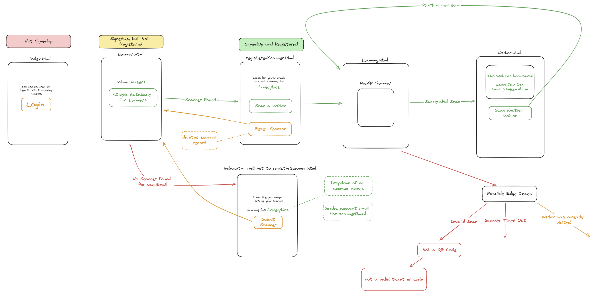
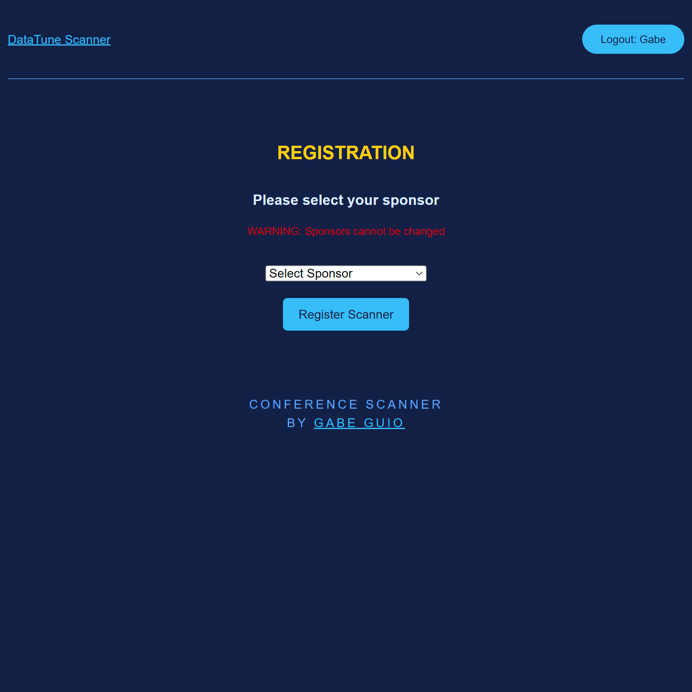
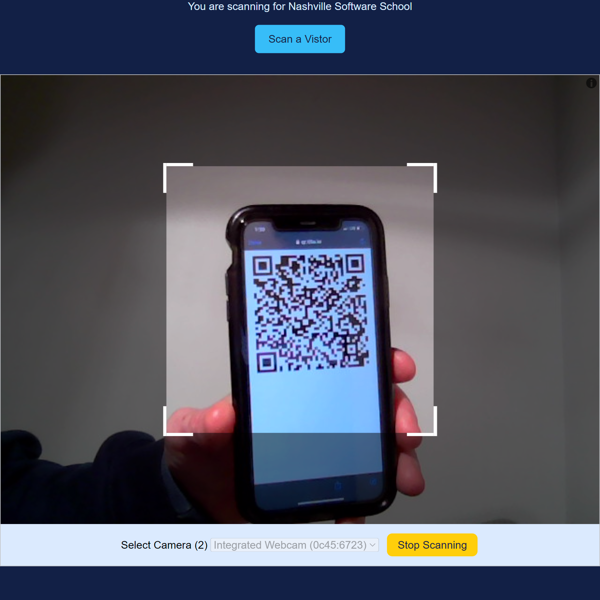
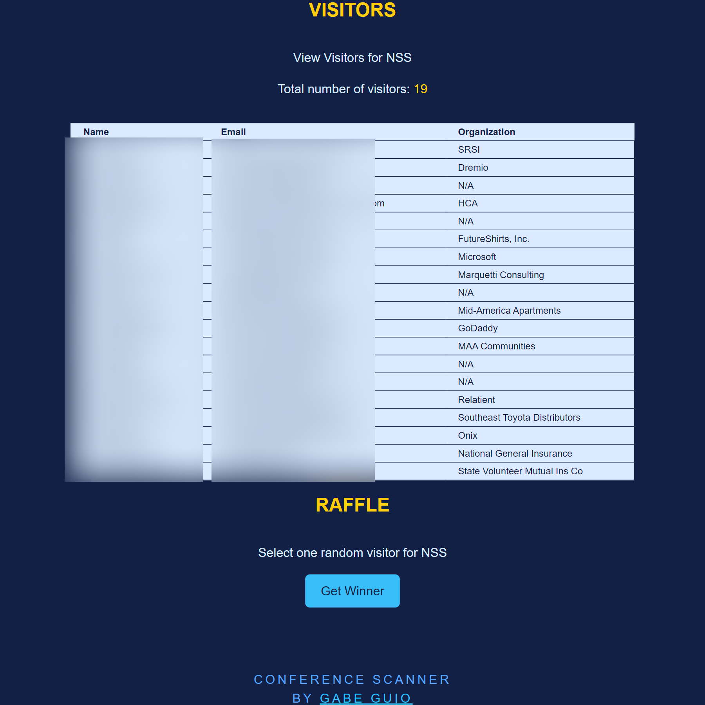
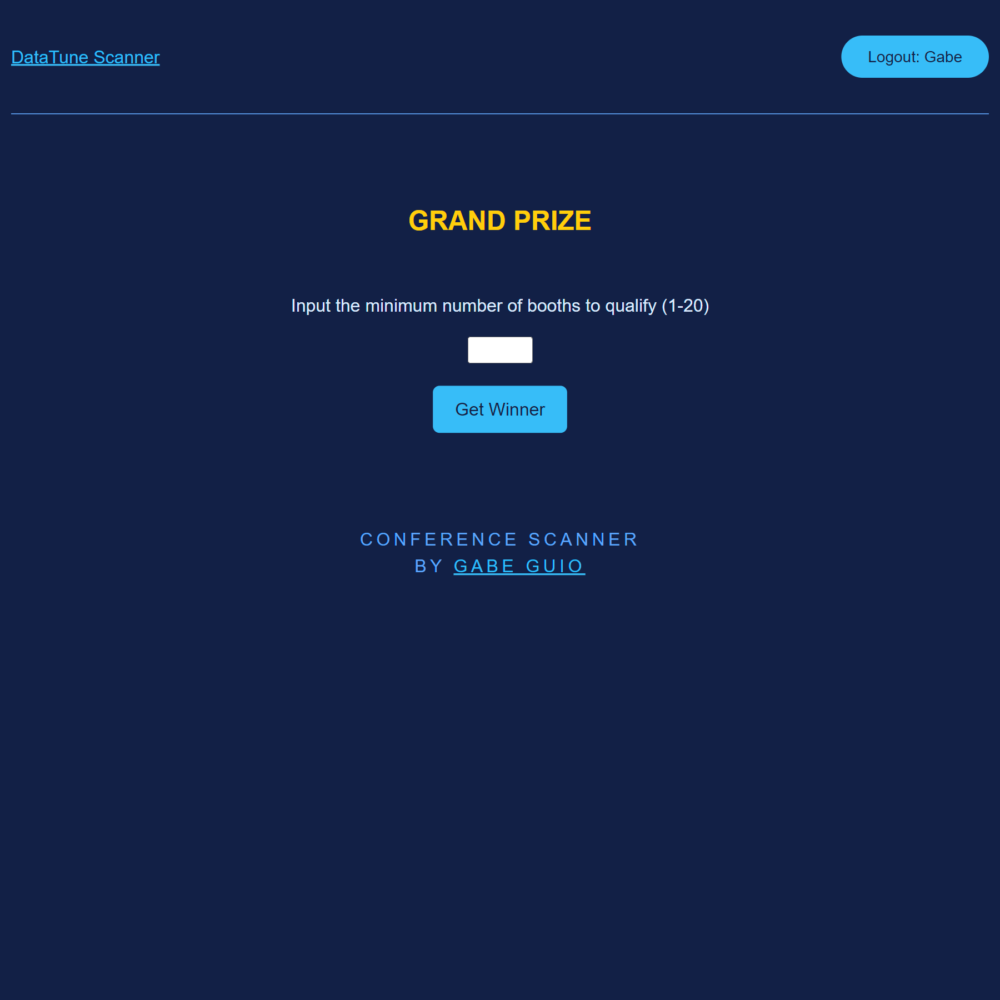

# Conference Scanner

## Overview

The app is meant for sponsors at a tech conference to scan QR codes and keep track of booth visitors. Towards the end of the conference, each sponsor will select a random visitor for a sponsor prize. In addition, towards the end of the event, the conference organizers will select an attendee who has visited every sponsor for a grand prize.

## Technology

### Frontend

- JavaScript, HTML, CSS, Webpack, AXIOS

### Backend

- Java, AWS Lambda, DynamoDb

## Notable Dependencies

- The conference uses [Tito Event Management](https://ti.to/developers) to provide QR codes for every attendee. These QR codes will be printed on the attendee's badges to carry around the conference and scan at each booth. The QR codes have embedded information for an attendee's contact information.
- On the front end, the plan is to use an [embedded QR scanner](https://www.webqr.com/index.html) for the sponsors to pull up on their phones to scan attendees.

## User Flow Diagram

_Image 1: Programming flow for user signup/registration and scanning visitors QR code_

## User Stories

1. Use Case 1, **Get Scanner**: Retrieve the scanner profile based on the user's email. If a single sponsor has not been set, then redirect the user to create a scanner profile.

1. Use Case 2, **Create Scanner**: Register a scanner profile for a single sponsor.

2. Use Case 3, **Update Scanner**: Update the single sponsor for a scanner profile.

3. Use Case 4, **Add a Visit to the Sponsor Booth**: A scanner scans an attendee's QR code, and the attendee has now visited that sponsor’s booth.

4. Use Case 5, **Get all Visited Attendees by Sponsor**: A sponsor would like to view every attendee who has visited their booth.

5. Use Case 6, **Get a Random Attendee by Sponsor**: A sponsor can roll a random attendee who has visited their booth to win the sponsor raffle.

6. Use Case 7, **Get a Random Attendee that Visited Every Sponsor**: The Organizer would roll from a query of all random attendees who have visited every booth at the conference to win the grand prize raffle.

## Pictures

_Image 2: Scanner Registration Page_

_Image 3: Embedded QR Code Scanner to Scan Badges_

_Image 4: Scanner Can View All Visitors and Raffle Select a Random Visitor_

_Image 5: Organizers Can Select Select a Winner Based On Unique Number of Sponsors Visited_